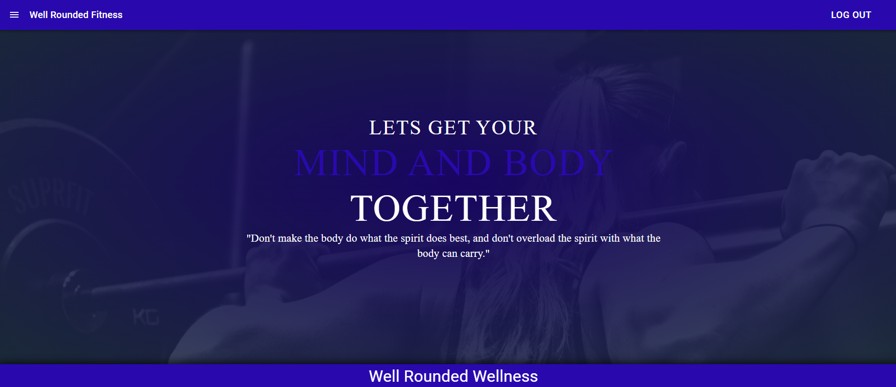

# Project Name: Well Rounded Fitness

### Link to Deployed Application
https://wellness-2021.herokuapp.com/

Project Image

## Technologies Used:
React, React Router, React Spring, Redux, Axios, Express, Mongoose, Passport, Bcrypt, Nodemon, Material UI, API's.

## Project Description:
The Well Rounded Fitness Application is all about helping you meet your fitness goals with a unique user experience that gives you the tools to succeed. Begin the application by logging in with your own personal account. Accounts are created with a username and password. Log into the account to begin. Entering the application brings the user to a navigation bar interface with Nutrition, Fitness, and Journal pages. Following any of those links takes the user to each of the specified pages. As a focal point of everyones fitness goal, the Nutrition Page provides the data one needs to successfully get the nutrional information that need to be successfull. Featuring three APIs, the Nutrition page displays important nutritional data for the servings of food the user will look up. Users can view protein values, carbohydrate information, as well as information on sugars. The Fitness page is a direct way for the user to review exercises and meet understand the sets for those excercises.The Fitness page offers views for the user to choose a work out along with understanding the how to properly perform the work out.

